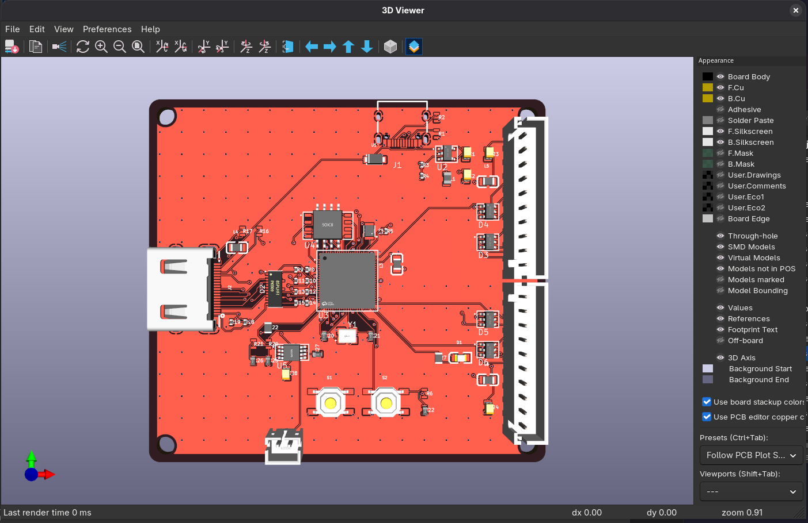
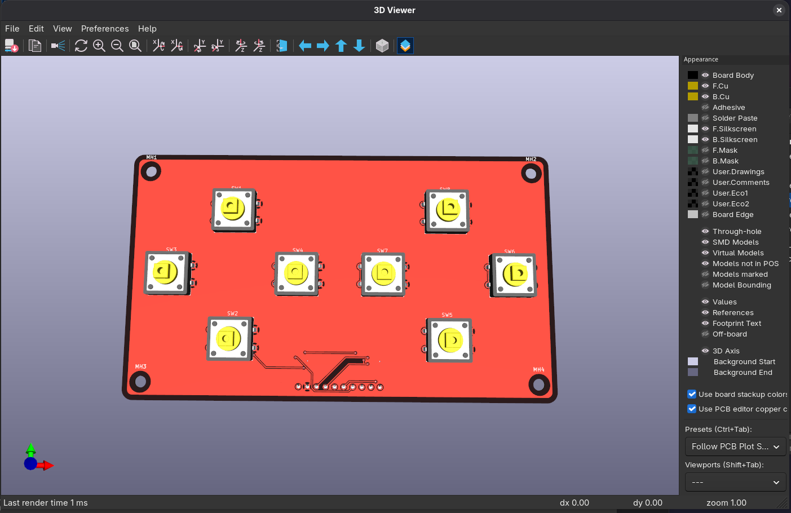

# RP2350 Videogame Console

A homebrew videogame console built around the Raspberry Pi **RP2350B**, with a matching
8-button arcade controller. Both PCBs are designed circuit-as-code (JITX) and taken through
KiCad layout → Freerouting → DRC → JLCPCB fabrication.

| Console | Controller |
|---|---|
|  |  |

## The console

The main board: an RP2350B microcontroller that reads up to two controllers, renders to a TV
over HDMI/DVI, and plays game audio through a small speaker.

- **MCU:** RP2350B (QFN-80) + 16 MB QSPI flash (W25Q128JV), 12 MHz crystal
- **Video:** HDMI connector driven as DVI over the RP2350 HSTX peripheral (4 TMDS pairs)
- **Power:** USB-C in → 3.3 V buck (TLV62569) + the RP2350 core SMPS
- **Controllers:** 2× JST-XH 1×10 ports (one per controller), each with SRV05-4A ESD
- **Audio:** PWM → RC filter → PAM8302A class-D amp → JST-PH speaker
- **I/O:** BOOTSEL + RUN buttons, status LED
- **Board:** 72 × 66 mm, 4-layer (JLC04161H), 75 parts

## The controller

An 8-button arcade-style gamepad on a single faceplate PCB that plugs into a console port
with a JST-XH cable.

- **Buttons:** 8 tactile switches (active-low; pull-ups + 3V3 live on the console end)
- **Link:** JST-XH 1×10 (8 buttons + GND + 3V3)
- **Protection:** SRV05-4A ESD arrays on the button lines
- **Board:** 120 × 70 mm, 2-layer, 31 parts

## Layout

```
pcbs/
  console/        RP2350 console — JITX source, KiCad export, routed board, fab
    routing/production/   JLCPCB gerbers + drill + CPL + BOM
  controller/     arcade gamepad — JITX source, routed board, fab
    fab/                  JLCPCB gerbers + drill + CPL + BOM + STEP
  screenshots/    3D renders
```

Each board's `routing/` holds the canonical routed `.kicad_pcb`. The JLCPCB upload set
(gerbers zip, drill, CPL/position CSV, and an LCSC-resolved BOM) lives in the console's
`routing/production/` and the controller's `fab/`.

## Manufacturing status

- **Console** — routed, 0 unconnected; one tight `hole_to_hole` in the QFN escape still wants
  a quick interactive-router via-shove before ordering PCBA. BOM is JLCPCB-uploadable.
- **Controller** — fully routed, DRC clean, fab package ready.

## Rebuilding from source

Each project is a JITX (Python) design. Recreate its virtualenv in the project folder
(`.venv` is not committed and is path-specific), then build with the project `.venv/bin/jitx`.
The routed boards are committed because they are not regenerable from source (Freerouting +
manual finishing) — do not re-export over them.
